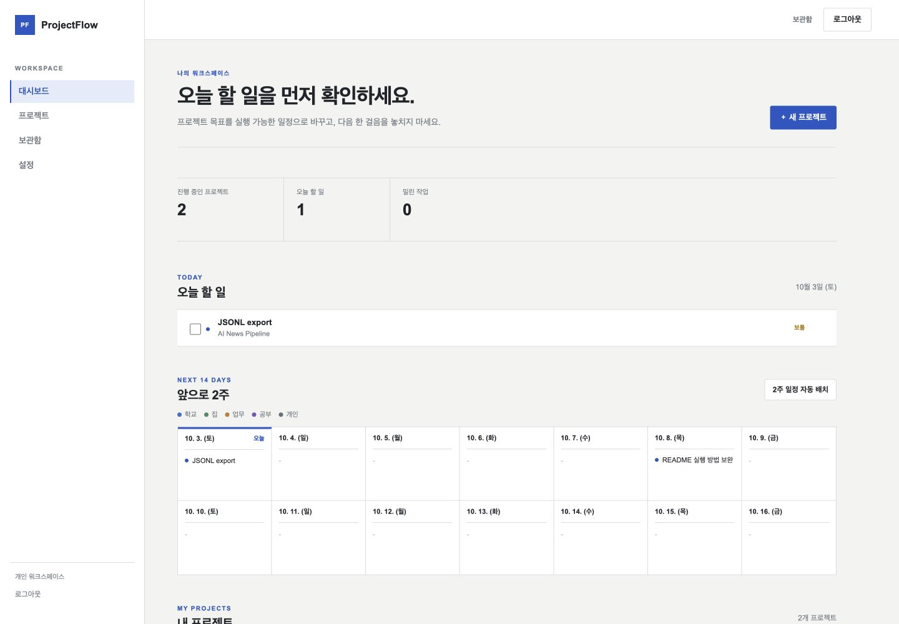
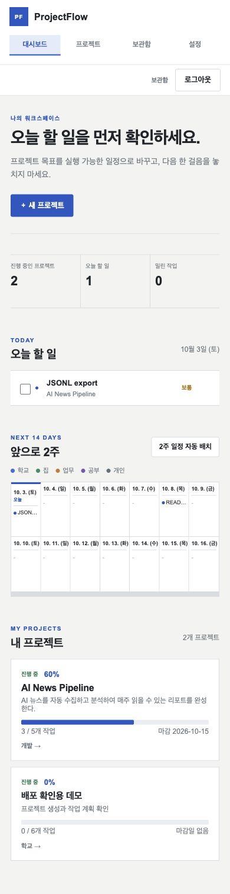
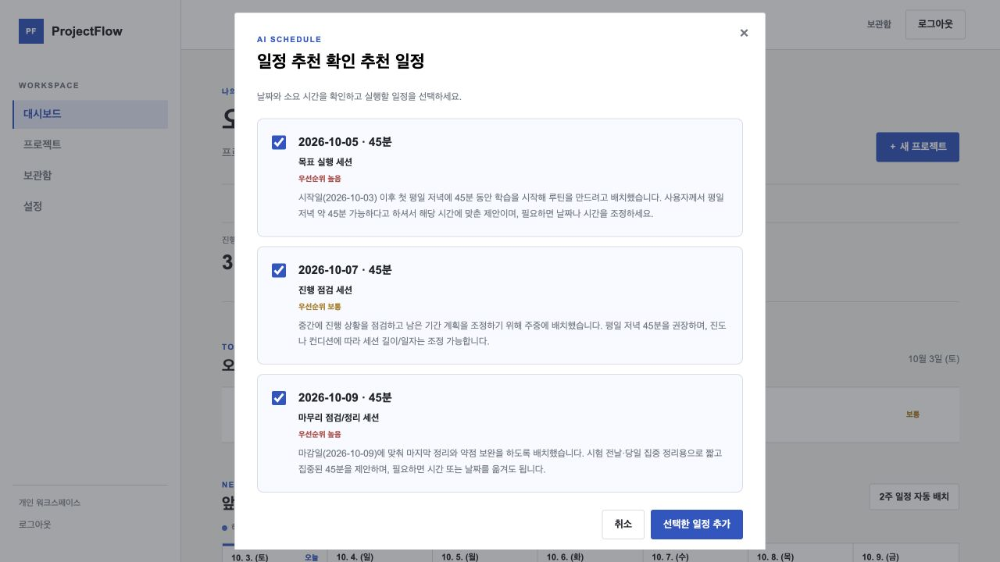

# ProjectFlow
목표를 실행 일정으로 바꾸고, 진행 중인 작업과 문제를 바탕으로 다음 행동을 제안하는 개인 프로젝트 관리 서비스입니다.

**[배포된 서비스](https://a1-3-sand.vercel.app)** · [서비스 기획서](docs/service-plan.md) · [제출 자료 안내](docs/submission.md)

## 서비스 사용 흐름
1. 로그인 화면에서 **데모 워크스페이스로 미리보기**를 선택합니다.
2. 새 프로젝트에 이름·목표·마감일을 입력하고 **AI 일정 추천**을 누릅니다. 설명에 가능한 시간을 적으면 일정 제안에 반영됩니다.
3. 추천 날짜와 소요 시간을 확인해 필요한 일정만 추가합니다.
4. 프로젝트에서 작업·이슈를 기록하고 **프로젝트 분석**으로 요약과 다음 행동을 확인합니다.
5. 완료한 작업과 모든 작업을 마친 프로젝트는 **보관함**에서 확인합니다.

로그인과 저장은 학습용 브라우저 데모입니다. 실제 계정 비밀번호를 사용하지 마세요. 데이터는 사용 중인 브라우저에 저장되며 기기 간 동기화는 제공하지 않습니다.

## 페이지 구성
| 페이지 | 사용자에게 제공하는 기능 |
| --- | --- |
| 로그인 | 데모 워크스페이스 진입 |
| 대시보드 | 프로젝트 생성, 오늘 할 일, 2주 일정 |
| 프로젝트 | 작업 완료·추가, 이슈 관리, 진행률 |
| AI 인사이트 | 질문 입력, 상황 요약, 다음 단계와 위험 대응 |
| 보관함 | 완료한 작업과 완료·보관 프로젝트 |
| 설정 | 프로젝트 유형 관리, 선택 학기 Canvas 과제 연동 |

데스크톱은 사이드 메뉴, 모바일은 상단 메뉴로 이동합니다.

## 실제 서비스 화면
2026년 10월 3일 공개 배포 URL에서 촬영한 데모 화면입니다. API 키와 개인 과제는 포함하지 않았습니다.

### 데스크톱


### 모바일
<details>
<summary>390px 모바일 전체 화면</summary>



</details>

### AI 일정 추천
입력한 목표와 “평일 저녁 45분 가능” 조건에 따라 날짜·소요 시간을 제안한 실제 API 응답입니다. 선택한 날짜가 작업 예정일에 저장되는 것까지 확인했습니다.



[AI 프로젝트 분석 결과](docs/screenshots/ai-analysis.jpg) · [전체 증빙과 검증 결과](docs/verification.md)

## 기술 스택과 요청 흐름
| 기술 | 역할 |
| --- | --- |
| HTML | 페이지 구조, 입력 폼, 결과 영역 |
| CSS | 레이아웃, 카드 스타일, 반응형 |
| 바닐라 JavaScript | 입력 수집, fetch 요청, 화면 갱신, 브라우저 저장 |
| Python · requests | 입력 검증, AI API 호출, 결과 검증 |
| Vercel Serverless Functions | 배포 환경에서 Python 요청 처리 |
| Codyssey OpenAI 호환 API | gpt-5-mini로 일정과 분석 생성 |

```text
사용자 입력 → JavaScript fetch('/api/...')
→ Vercel Python → Codyssey /v1/chat/completions
→ Python 응답 검증 → JavaScript 결과 표시
```

프론트는 React·Vue 없이 구현했습니다. AI 일정 추천과 프로젝트 분석은 실제 모델을 호출합니다. 2주 일정 자동 배치는 작업 수에 따른 규칙 기반 기능입니다.

## 실행 및 배포
```bash
git clone https://github.com/gaori2952/A1-3.git
cd A1-3
python3 -m venv .venv
source .venv/bin/activate
python -m pip install -r requirements.txt
export OPENAI_API_KEY="YOUR_CODYSSEY_VIRTUAL_KEY"
export OPENAI_BASE_URL="https://copa.codyssey.kr/v1"
export OPENAI_MODEL="gpt-5-mini"
python dev_server.py
```

`http://localhost:8000/login.html`에서 시작합니다. `dev_server.py`가 페이지와 Python API를 함께 제공합니다. 정적 파일 서버만 실행하면 AI API는 동작하지 않습니다.

Vercel에서 이 GitHub 저장소를 연결하고 아래 환경 변수를 **Production**에 등록한 뒤 배포합니다. main 변경은 자동 배포되며, 환경 변수 변경 후에는 재배포해야 합니다.

| 환경 변수 | 설정 값 |
| --- | --- |
| OPENAI_API_KEY | Codyssey에서 발급한 가상 키 |
| OPENAI_BASE_URL | https://copa.codyssey.kr/v1 |
| OPENAI_MODEL | gpt-5-mini |

키는 Python 서버에서만 읽으며 코드·README·스크린샷에 넣지 않습니다. `.env.example`은 항목 안내용이며, 로컬 서버는 .env를 자동으로 읽지 않습니다. [운영체제별 실행·Vercel 배포·키 교체 방법](docs/setup-and-deployment.md)

## 입력과 실패 처리
- 필수값이 없으면 입력 안내를 표시하고 AI를 호출하지 않습니다.
- API 인증·쿼터·네트워크·응답 형식 오류를 구분해 안내합니다.
- 분석 중 중복 클릭을 막고 지연 안내와 타임아웃을 제공합니다.
- API 실패 시 고정 문구를 AI 성공 결과로 표시하지 않습니다.
- 자동 재시도는 하지 않습니다. 분석 완료 후 5초 간격을 두며, 제공자에서 비용·쿼터를 관리합니다.

[AI 입력·출력·실패 기준](docs/service-plan.md) · [HTML/CSS/JS와 Python 구조 설명](docs/architecture.md)

## 저장소 구조
```text
A1-3/
├── *.html                   # 6개 페이지
├── css/                     # 레이아웃·반응형
├── js/                      # UI·요청·브라우저 저장
├── api/                     # Python Serverless Functions
├── requirements.txt
├── pyproject.toml           # Vercel Python 진입점
├── vercel.json
├── dev_server.py
├── .env.example
├── tests/                   # API·보관함 회귀 테스트
└── docs/
    ├── service-plan.md      # 서비스 기획서
    ├── architecture.md      # 구성과 요청 흐름
    ├── setup-and-deployment.md
    ├── requirements-checklist.md
    ├── verification.md      # 검증 결과
    ├── ai-coding-conversation.md
    ├── ai-coding-evidence.md
    ├── submission.md       # 제출 패키지 안내
    └── screenshots/        # 데스크톱·모바일·AI 증빙
```

## 제출 패키지
| 필수 결과물 | 위치 |
| --- | --- |
| 배포 서비스 | [Vercel URL](https://a1-3-sand.vercel.app) |
| 코드와 커밋 이력 | [GitHub 저장소](https://github.com/gaori2952/A1-3) |
| README | 이 문서 |
| 서비스 기획서 | [service-plan.md](docs/service-plan.md) |
| 서비스·AI 코딩 증빙 | [스크린샷](docs/screenshots/), [AI 코딩 협업 기록](docs/ai-coding-conversation.md) |

[요구사항별 구현 근거](docs/requirements-checklist.md)

Canvas는 선택 기능입니다. 설정 화면에 개인 API 토큰을 입력해 조회하며, 학교 과제를 AI 제공자에 자동 전송하지 않습니다. [Canvas 설정](docs/setup-and-deployment.md#canvas-선택-기능)
