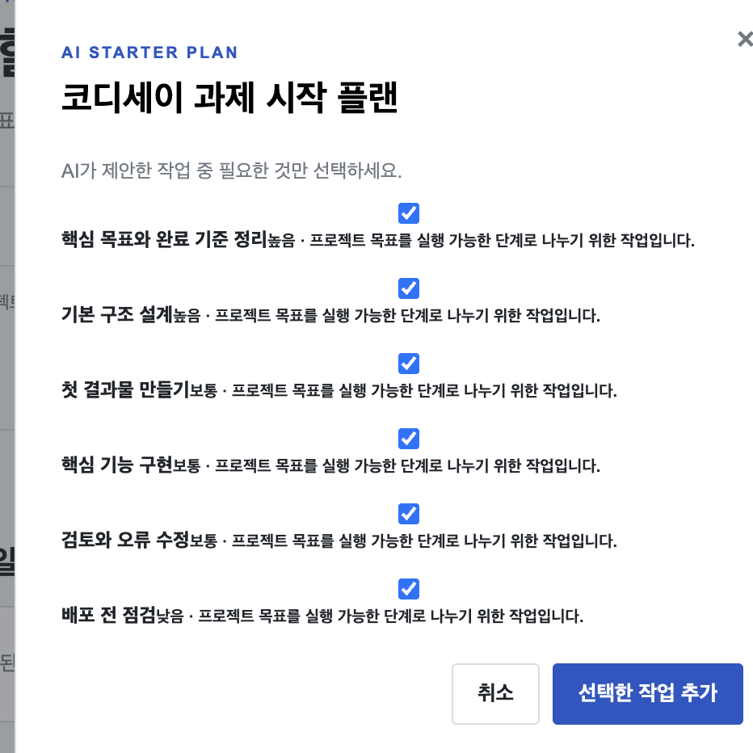

# AI 코딩 도구 협업 기록

사용 도구: Codex

프로젝트 개발 과정에서 이루어진 실제 요청과 수정 내용을 정리했습니다. 요청 문장은 원래 의미를 유지하면서 제출 문서에 적합한 표현으로 편집했습니다. API 키와 Canvas 토큰은 포함하지 않았습니다.

## 1. AI 추천 결과와 화면 구성 개선

**개선 요청**

프로젝트마다 동일한 작업이 반복되는 추천 결과를 개선하고, 체크박스·작업 제목·설명을 명확하게 구분해 표시하도록 요청했습니다.

**구현 내용**

프로젝트 목표를 실제 AI API에 전달해 목표에 맞는 결과를 생성하도록 변경했습니다. 추천 항목은 제목, 우선순위, 추천 이유가 구분되는 카드 형태로 구성했습니다.

## 2. AI 일정 추천 기능 설계

**개선 요청**

사용자가 정한 목표를 실행할 수 있도록 날짜와 소요 시간을 제안하는 일정 추천 기능을 요청했습니다.

**구현 내용**

목표와 마감일을 기준으로 실행 일정을 생성하고, 사용자가 선택한 일정의 날짜를 작업 예정일에 저장하도록 구현했습니다. 실제 API 응답과 저장 결과를 배포된 서비스에서 확인했습니다.

## 3. Canvas 조회 범위 조정

**개선 요청**

과목 수 초과 오류를 해결하고, 이번 학기에 해당하는 과목의 과제만 조회하도록 요청했습니다.

**원인 분석 및 구현 내용**

지난 학기 과목도 활성 상태로 반환될 수 있었으며, 학기 필터를 적용하기 전에 과목 수 제한을 검사하고 있었습니다. 학기 정보와 날짜를 기준으로 선택한 학기의 과목을 먼저 선별한 뒤 과제를 조회하도록 변경했습니다.

과거 과목 60개와 이번 학기 과목 1개를 반환하는 mock 테스트를 통해 이번 학기 과목에 대해서만 과제 조회 요청이 이루어지는지 확인했습니다.

## 4. 평가용 증빙 자료 구성

**개선 요청**

평가 요구사항에 맞춰 데스크톱·모바일·AI 기능 동작 스크린샷을 준비하고, README에서 확인할 수 있도록 구성해 달라고 요청했습니다.

**구현 내용**

실제 배포 화면을 촬영해 저장소에 추가하고 README에 이미지와 설명을 연결했습니다. 실제 AI 호출 결과와 mock 테스트 결과를 구분해 검증 현황에 기록했습니다.

[서비스 화면 및 검증 현황](verification.md) · [GitHub 변경 이력](https://github.com/gaori2952/A1-3/commits/main)

## 학기 시간표와 학습 일정 연결

**요청 요약:** 고정 수업 시간표에 새 할 일과 반복 복습을 결합하고, 주간 시간표와 간결한 월간 달력을 함께 사용하는 방향으로 개선한다.

**설계와 구현:** 수업·개인 일정·공부 시간을 반복 규칙으로 관리하고, 날짜별 메모 및 복습 미리보기를 연결했다. 복습은 기존 일정과 겹치지 않는 시간을 선택하며, 저장 전 사용자가 적용할 항목을 선택한다. 모바일에서는 월간 달력과 날짜별 목록을 먼저 보여준다.

**검증과 수정:** 시간표의 불명확한 과목명과 종료 시간을 확인했다. 반복 기간, 날짜별 완료 처리, 일정 충돌, 중복 생성 방지를 테스트하고 모바일 레이아웃과 기존 Notes 연결을 브라우저에서 점검했다.
